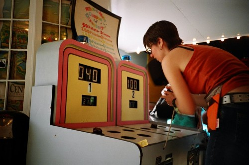
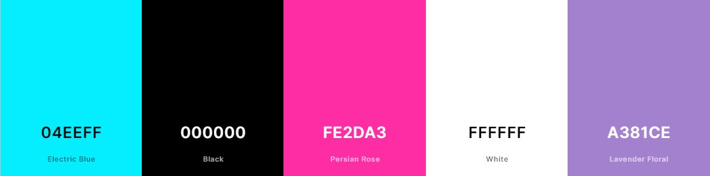
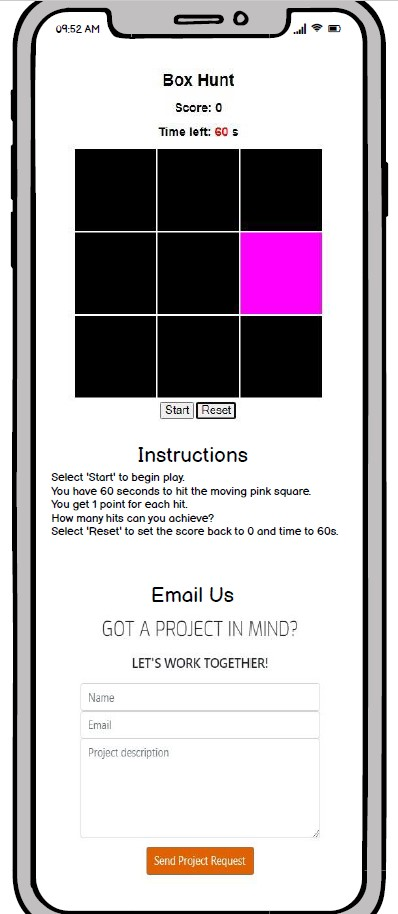
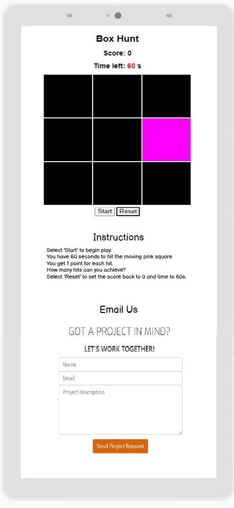
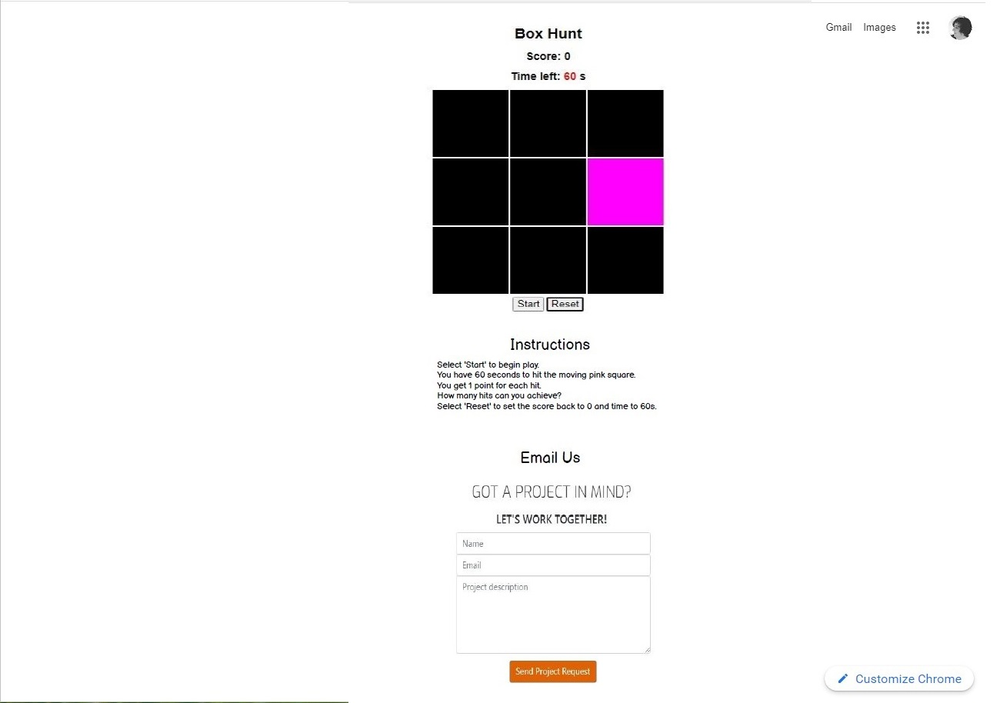
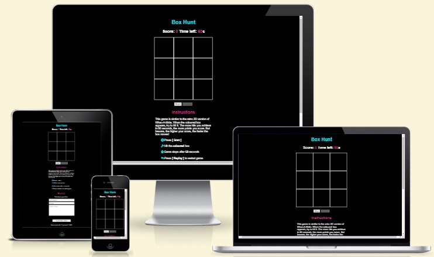
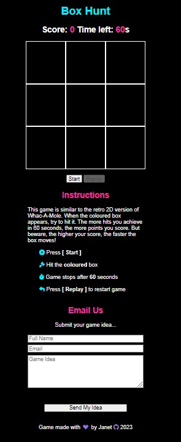
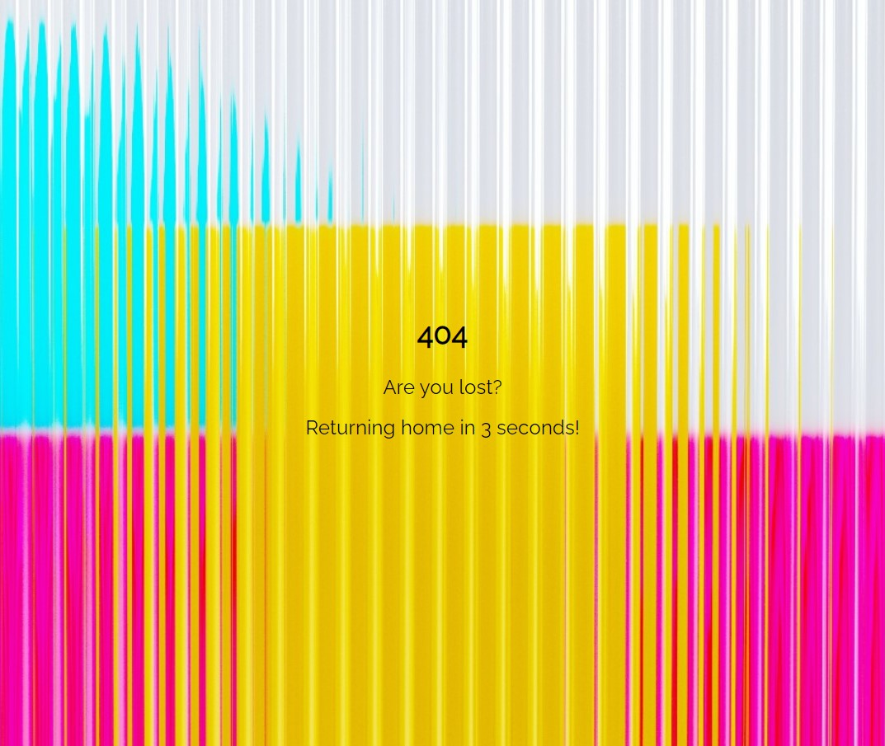

## Project Purpose

This is a Code Institute student project for Milestone 2, built to satisfy the requirements for the EKC DigitalLearn Diploma (Level 5) in [Web Application Development](https://www.ekcgroup.ac.uk/ekc-digitallearn/computing/web-application-development-diploma). 

This project has been created in order to provide 2D gaming entertainment on a deployed interactive website. The project was built using **Gitpod**. 

The information has been presented in a way that ensures the users achieve their goals of:
* understanding what the site's function is
* understanding how to play the game
* being able to email suggestions to us

The site also enhances the owner's goals by:
* showcasing their gaming creativity
* showcasing their JavaScript programming skills
* showcasing their testing skills


## Project Requirements

* The technologies used were HTML, CSS and **JavaScript**.
* This interactive front end project contains one page with a JavaScript game and an email form for contacting us
* This README.md file explains what the project does and the value it provides for the users
* Version control is provided by Git and GitHub
* External code, libraries, templates, images, information, etc. will be listed in the **Credits**, at the bottom of this README.
* This project is deployed via GitHub Pages and the code in a GitHub repository.


<h1 align="left">2D Retro Game: Box Hunt</h1>

[View the live project here.](https://janet-dev.github.io/ci-milestone-project-2/)

The aim of the project is provide an easy to play game for most ages and to provide a non-taxing escape from daily stress. This game is based on the popular arcade and 2D retro versions of Whac-A-Mole.

The site is designed to be responsive and accessible on a range of devices, making it easy to use for potential users.

<h2 align="left"></h2>


## User Experience (UX)

### User stories

As this is a brand new site with limited features, so the user stories were taken from the perspective of the visiting or anonymous user. We don't have any traffic data yet and we don't really know who are users are at this point.
* As a visiting user, I would like to connect with the company via email.
* As a visiting user, I would like to easily understand how to play the game.
* As a visiting user, I would like to play with increasing difficulty.
* As a visiting user, I would like to see my score.

### Owner goals

* I would like to build a retro 2D game.
* I would like to build a family game which is easy for both children and adults to use.
* I would like the game to be visually attractive and fun to play.

### Design

#### The Game

- This game is inspired by the mini course [Learn JavaScript by building 7 games](https://www.freecodecamp.org/news/learn-javascript-by-building-7-games-video-course/) by **Ania Kubow** on freeCodeCamp. In particular, the tutorial [Whac-a-mole](https://www.youtube.com/watch?v=ec8vSKJuZTk) starting at time 1:04:37.

- What is this game? In the original arcade game of [Whac-A-Mole](https://en.wikipedia.org/wiki/File:Whac-a-mole_-_Tokyo_-_Jan_7_2020.webm), the player tries to hit the 'moles' which pop up through various holes in a cabinet top. Points are scored depending on how fast the 'moles' can be hit. The game starts out slow enough for most people to hit the 'moles', but eventually speeds up with them popping up for shorter periods. In this 2D version of the game, the 'moles' are replaced by coloured square targets, randomly generated within a 3x3 grid. Points are scored by clicking or touching the target, but the player can only score a maximum of one point per appearance. The game currently increases in difficulty, by moving faster as the user gains more points.

- Why this game? This game was developed for anyone who just wanted a few moments of escapism or to get out of their current head-space. A minimalistic design with bright colours was developed to make it fun but not overly cluttered or busy. The game design lends it to be easily scaled up or down depending on the device screen size. This 60 second version is just short enough to play whilst waiting in a queue, or to pass between a group of players for some friendly competition.

- View the game design flowchart [here](docs/ux/game-flowchart.pdf), to see how the functions are connected. These functions are:

1. **createGrid()** - 3x3 grid of 9 tiles was created using JavaScript. In order to create each tile:
	- a 'div' with the class of 'tile' was generated
	- tile was given a unique id between 0 and 8
	- the tile was appended to the grid

2. **startGame()** - on selecting the start button, 
	- game defaults were set
		- score = 0
		- time left = 60 seconds
		- start button was disabled
		- reset button was enabled
	- the countdown timer interval was set to 1 second, i.e. the time left decremented every second from 60 seconds.
	- the random target generation interval for creating the target was set initially at 1 second. This gave the appearance of a target being generated every second.
	- isTargetHit() function called to check if target was hit.

3. **countDown()** - throughout the game, the time left counts down every second until 0 is reached. When 0 is reached, the game ends by calling the gameOver() function.

4. **randomTarget()** - this function creates the random target: 
	- firstly removes any target generated, by removing the associated class of 'target' from the tile
	- generates a random integer between 0 and 8
	- assigns the tile with the id equal to this random integer, as the new target by giving it the class of 'target'
	- a potential hit postion is now assigned to the target tile

5. **isTargetHit()** - this function checks if the target has been clicked on by a mouse or touched via a touchscreen:
	- add an event listener for 'click' - this checks for either mouse or touch selection
	- checks if tile selected is the correct hit position of the target. If yes:
		- the random target generation interval is cleared
		- the score is incremented and displayed on the screen
		- the hit position is cleared to stop multiple successful hits on the one position (thought it is possible to randomly generate the same number twice)
		- a new random target generation interval, less than the previous one is assigned - this gives the effect of a faster moving target
	- if the target has not been hit, the score and the random target generation interval stay the same i.e. the target will keep moving at the current speed

6. **resetGame()** - on selecting the reset button:
	- all intervals are cleared -  the game stops running
	- screen displays for score and time left are set back to 0 and 60 seconds respectively
	- the removeTarget() function is called 
	- start button is enabled
	- reset button is disabled

7. **gameOver()** - is called when the time left is 0
	- 'Game Over!' text is generated
	- removetarget() function is called
	- start button is disabled
	- reset button is enabled, in order to force the user to reset the game before replaying

8. **removeTarget()** - removes the event listener and ability to restart the game by randomly clicking on the grid by:
	- removing the class of 'target' from any tile
	- making sure any potential hit position is cleared
	- removing the event listener, so that clicking on the grid results on no action

#### Colour Scheme

- White (#ffffff) grid on a black (#000000) background are used for the game board.
- Electric blue (#04eeff) for the moving target, main h1 heading and icons.
- Persian rose (#fe2da3) for other headings.
- Lavender floral (#a381ce) for the footer icons.

<h2 align="left"></h2>

This colour scheme was chosen for simplicity, readability and fun. The game was given a retro feel, which would appeal to adults and children alike. Inspiration was taken from palette number 4 [(Gentle Lilac)](https://blog.depositphotos.com/neon-color-palettes.html) of the blog post "30 Trendy Neon Color Palettes for Bold Designs" by Maria Sibirtseva.

#### Typography

For the site, [Raleway font](https://fonts.google.com/specimen/Raleway) is used for good readability and contrast when required. It is considered to be number eight in the [The 10 Best Google Fonts in 2023](https://kinsta.com/blog/best-google-fonts/), so should suit most sites. If this font is unavailable, san serif is used as a fallback.

#### Imagery

Game visuals were inspired by Sean Young's [Breakout Game](https://seanyoung247.github.io/breakout/).


### Wireframes

Mobile
<h2 align="left"></h2>

Tablet
<h2 align="left"></h2>

Desktop
<h2 align="left"></h2>


## Features

This website consists of one page containing the game area, instructions and contact form. It was decided to produce the game on a black background as the gave a more polished look to the product and looked much better on mobile devices. The site will look the same on all devices.

<h2 align="left"></h2>

### Navigation

There is no navigation as this is a small one-page site.

### Home Page

<h2 align="left"></h2>

This page features:

- a coloured title, which tells the user the name of the game
- the 'Score' which will increment with each allowed hit on the coloured moving target
- the 'Time Left' in the current game, which counts down from 60 seconds on clicking the 'Start' button
- the game board of 9 tiles, one of which will initially have a randomly generated coloured target tile every 1 second. It will seem like the target is moving position every second, but time period between each random generation will decrease with each increase of the score - the target will speed up
- 'Start' button to start play and generate the moving target
- 'Reset' button to return the game back to it's initial start
- 'Instructions' to how to play the game
- contact area where users can email in their game idea
- footer with a link to a GitHub account

### 404 Page

<h2 align="left"></h2>

As this is a one-page site, there is an automatic redirect back to the home page from the 404 page.


## Future Features

After asking the advice of other gamers and developers, further features are required:
* show highest score attained so far by using **localStorage**
	- [Window.localStorage](https://developer.mozilla.org/en-US/docs/Web/API/Window/localStorage)

* create an higher level where points are deducted when the user hits a black tile

* create higher levels where the number of tiles increases, for example:
	- 4x4 grid = 16 tiles
	- 5x5 grid = 25 tiles
	- 6x6 grid = 36 tiles

* make the game for 2 players, by generating 2 different coloured tiles with separate scoring

* develop an accessible level for those who require a larger game board with slower moving targets, by maximising the grid size for larger tablets and desktops


## Technology Used

* [HTML5](https://en.wikipedia.org/wiki/HTML5) and [CSS3](https://en.wikipedia.org/wiki/CSS) for building and custom styling the site.
* [JavaScript](https://www.w3schools.com/js/js_history.asp) which is used to make the web pages interactive.
* [EmailJS](https://www.emailjs.com/) provides the JavaScript library for sending emails without the need for server-side technology.
* Wireframes from [Balsamiq](https://balsamiq.com/).
* Developer platform from [Gitpod](https://www.gitpod.io/).
* IDE integrated into Gitpod from [Visual Studio Code](https://code.visualstudio.com/).
* Debugging assisted by [Chrome Developer Tools](https://developer.chrome.com/docs/devtools/).
* Version control integrated into Gitpod from [Git](https://git-scm.com/).
* Project deployment provided by [GitHub Pages](https://pages.github.com/).
* Raleway font from [Google Fonts](https://fonts.google.com/?query=raleway).
* Colour palette generated by [Coolors](https://coolors.co/).
* Icon library and toolkit from [Font Awesome](https://fontawesome.com/).
* Favicon created on [favicon.cc](https://www.favicon.cc/).
* Online photo editor from [Pixlr](https://pixlr.com/x/).
* Stock photos from [Unsplash](https://unsplash.com).
* Paint from [Microsoft](https://apps.microsoft.com/store/detail/paint/9PCFS5B6T72H?hl=en-us&gl=us)
* Snip and Sketch from [Microsoft](https://apps.microsoft.com/store/detail/snipping-tool/9MZ95KL8MR0L?hl=en-gb&gl=gb)
* PDF Reader from [Adobe Acrobat Reader](https://www.adobe.com/uk/)
* Automated testing provided by [Jest](https://jestjs.io/).
* HTML validation from [W3C](https://validator.w3.org/#validate_by_input).
* CSS validation from [Jigsaw (W3C)](https://jigsaw.w3.org/css-validator/).
* JavaScript validation from [JSHint](https://jshint.com/)
* Web page quality improvements assisted by [Lighthouse](https://developer.chrome.com/docs/lighthouse/overview/).
* Web Accessibility Evaluation Tools by [WAVE](https://wave.webaim.org/)


## Testing

See the document [TESTING.md](TESTING.md) for the code validation, automated and manual tests.


## Deployment

### Gitpod LocalHost Deployment

1. To run a frontend (HTML, CSS, Javascript only) application in Gitpod, [in the terminal](docs/pictures/deploy-python.jpg), type:
	```python
	python3 -m http.server
	```
2. A blue button should appear to click: [_Make Public_](docs/pictures/deploy-port-8000.jpg),
3. Another similar blue button should appear to click: _Open Browser_. If this is not seen, click on the:
	* [_Ports icon_](docs/pictures/deploy-port-browser.jpg) **1** then the port address or globe icon **2** to run the project in a new browser tab.

The ports can also be accessed via the bottom blue banner, where it shows [_Ports: 8000_](docs/pictures/deploy-open-port.jpg)

In Gitpod you have superuser security privileges by default. Therefore you do not need to use the `sudo` (superuser do) command in the bash terminal.

### GitHub Pages

The project was deployed to GitHub Pages using the following steps...

1. Log in to GitHub and locate the [GitHub Repository](https://github.com/)
	- [See the screenshot](docs/pictures/github1.jpg)
2. At the top of the Repository (not top of page), locate the ["Settings" Button](docs/pictures/github2.jpg) on the menu.
3. Scroll down the Settings page until you locate the ["Pages" Section](docs/pictures/github3.jpg) on the left hand side.
4. Under "Branch", click the dropdown called "None" and [select "main"](docs/pictures/github4.jpg).
5. Branch section should look like [this screenshot](docs/pictures/github5.jpg). Wait a few minutes for the page to automatically refresh.
6. Scroll back to top of the page to locate the now published site in the ["GitHub Pages" section](docs/pictures/github6.jpg). Copy this link.
7. Go back to your repository and select the [Setting gear icon](docs/pictures/github7.jpg) to the right of "About".
8. Paste your url into the [box under "Website"](docs/pictures/github8.jpg) and click the "Save Changes" button.
9. You now have a [link for everyone](docs/pictures/github9.jpg) to use from your repository.

### Forking the GitHub Repository

By forking the GitHub Repository we make a copy of the original repository on our GitHub account to view and/or make changes without affecting the original repository by using the following steps...

1. Log in to GitHub and locate the [GitHub Repository](https://github.com/)
2. At the top of the Repository (not top of page) just above the "Settings" Button on the menu, locate the "Fork" Button.
3. You should now have a copy of the original repository in your GitHub account.

### Making a Local Clone

1. Log in to GitHub and locate the [GitHub Repository](https://github.com/)
2. Under the repository name, click "Clone or download".
3. To clone the repository using HTTPS, under "Clone with HTTPS", copy the link.
4. Open Git Bash
5. Change the current working directory to the location where you want the cloned directory to be made.
6. Type `git clone`, and then paste the URL you copied in Step 3.

```
$ git clone https://github.com/YOUR-USERNAME/YOUR-REPOSITORY
```

7. Press Enter. Your local clone will be created.

```
$ git clone https://github.com/YOUR-USERNAME/YOUR-REPOSITORY
> Cloning into `CI-Clone`...
> remote: Counting objects: 10, done.
> remote: Compressing objects: 100% (8/8), done.
> remove: Total 10 (delta 1), reused 10 (delta 1)
> Unpacking objects: 100% (10/10), done.
```

Click [Here](https://help.github.com/en/github/creating-cloning-and-archiving-repositories/cloning-a-repository#cloning-a-repository-to-github-desktop) to retrieve pictures for some of the buttons and more detailed explanations of the above process.


## Credits

A huge thank you to the following people and organisations, because without you, the website would not have been produced in it's present form.

### From the Course

Sample README and GitHub deployment instructions from [Code Institute](https://github.com/Code-Institute-Solutions/SampleREADME)

Markdown Cheatsheet from [Adam Pritchard](https://github.com/adam-p/markdown-here/wiki/Markdown-Cheatsheet#html)

### Media

[Whac-A-Mole](https://en.wikipedia.org/wiki/Whac-A-Mole) by Wikipedia

Girl playing Whac-A-Mole by [sa_ku_ra / sakura](https://www.flickr.com/photos/sa_ku_ra/18984918/) on Flickr
- Attribution 2.0 Generic [(CC BY 2.0)](https://creativecommons.org/licenses/by/2.0/)

Wallpaper for 404 page from [Maxim Berg](https://unsplash.com/@maxberg) on Unsplash

### Code

Although the code is the work of the author, some of the code has been sourced from or inspired by others.

Many of the references have been embedded as links throughout this document and indicated by the active blue text links.

[Learn JavaScript by building 7 games](https://www.freecodecamp.org/news/learn-javascript-by-building-7-games-video-course/) by Ania Kubow on freeCodeCamp

[Build your own CANDY CRUSH using JavaScript, HTML and CSS](https://www.youtube.com/watch?v=XD5sZWxwJUk) by Ania Kubow on YouTube

[Convert px to rem - An effective workflow](https://dev.to/swastikyadav/convert-px-to-rem-an-effective-workflow-4m4j) by Swastik Yadav on DEV Community

[Typical Device Breakpoints](https://www.w3schools.com/howto/howto_css_media_query_breakpoints.asp) from W3 Schools

[Sending Emails Using EmailJS](https://github.com/Code-Institute-Solutions/InteractiveFrontendDevelopment-Resume/tree/master/03-SendingEmailsUsingEmailJS/06-sending_emails) tutorial by Code Institute

[Creating a custom 404 page for your GitHub Pages site](https://docs.github.com/en/pages/getting-started-with-github-pages/creating-a-custom-404-page-for-your-github-pages-site) by GitHub Docs

[Custom redirects are not supported](https://til.simonwillison.net/github/github-pages) by Simon Willison


## Acknowledgements

Rohit Sharma - [Code Institute](https://codeinstitute.net/) Mentor, for the continuous feedback and guidance in industry standards.

Rachel Furlong - [EKC DigitalLearn](https://ekcgroup.ac.uk/business-units/ekc-digitallearn) Course Facilitator, for generous support and advice.
 