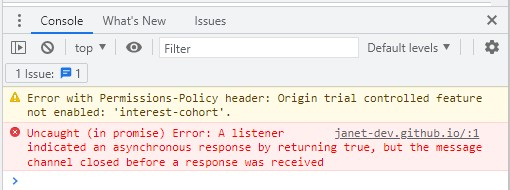
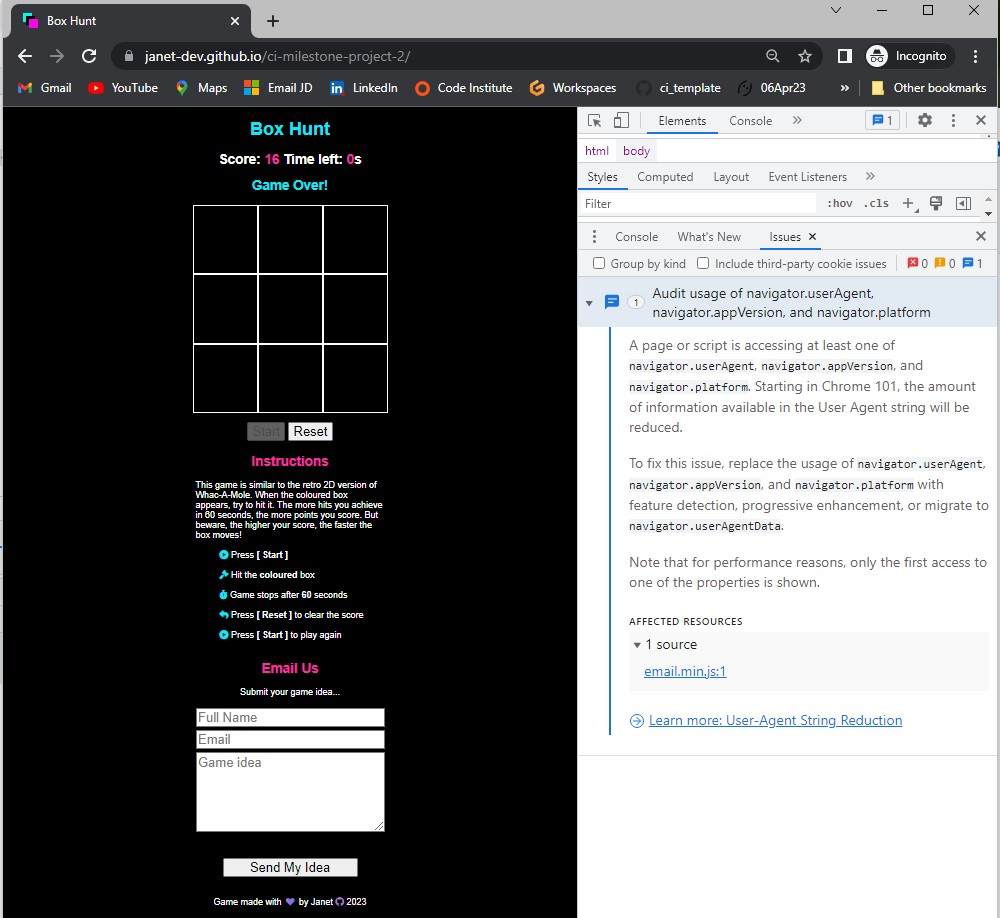
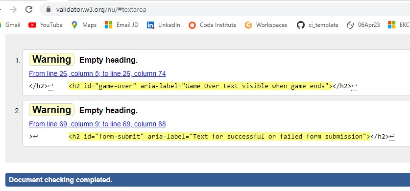
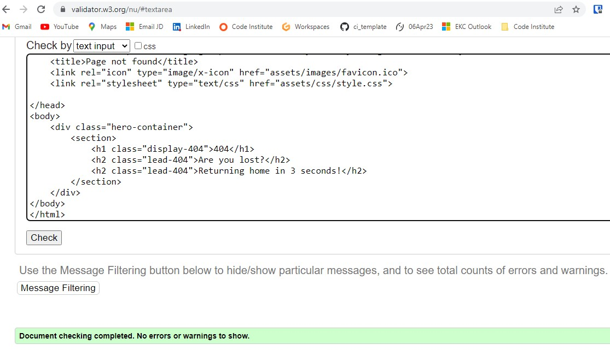
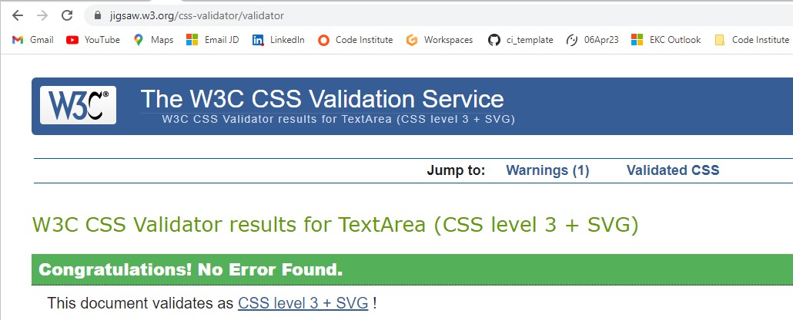
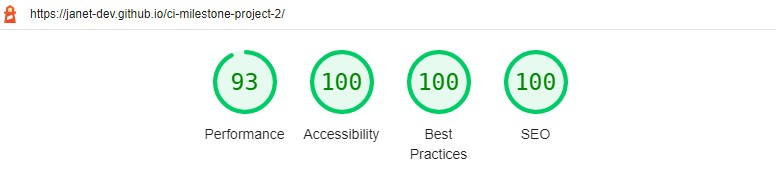
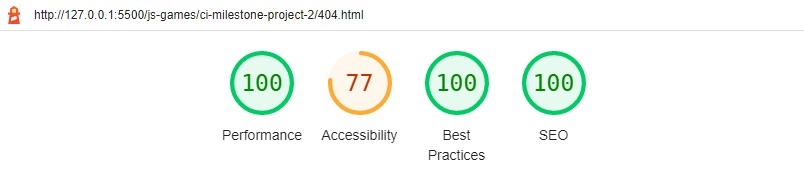
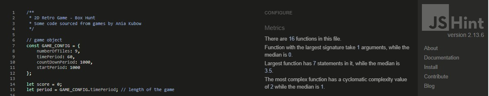
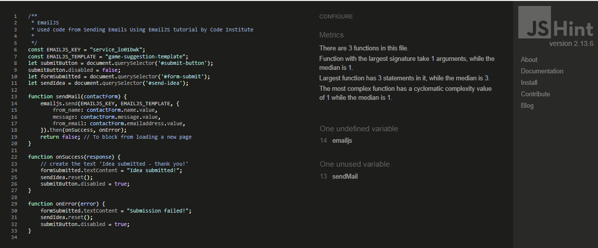
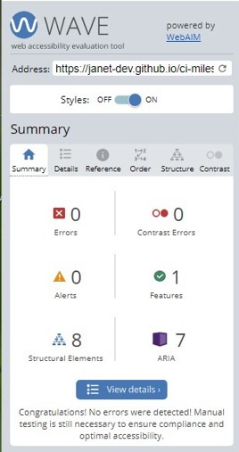

# Project Testing

## Jest Automated Testing
- [Jest](https://jestjs.io/) is a delightful JavaScript Testing Framework with a focus on simplicity. 
- Jest aims to work out of the box, config free, on most JavaScript projects.

To run tests in the terminal, type (without the `.test.js` extension):

`npm test -- filename`

## Manual Testing

**The site was built, tested and validated on the [Chrome browser](docs/pictures/chrome.jpg) only.**

### Supported Screen Sizes and Browsers

No framework was used for building the site, only HTML5, CSS3 and JavaScript - see the [supported browsers for HTML](https://www.w3schools.com/tags/ref_html_browsersupport.asp).
    - Chrome
    - Firefox
    - Safari
    - Opera
    - Edge

* Devices supported:
    - Mac
    - Windows
    - Android
    - iOS

* See the [default breakpoints](https://www.w3schools.com/howto/howto_css_media_query_breakpoints.asp) provided by W3 Schools for responsive building. Breakpoints are a representative of a subset of common device sizes and viewport dimensions—they don’t specifically target every use case or device. Instead, the ranges provide a strong and consistent foundation to build on for nearly any device. 

    | Breakpoint               | Dimensions |
    | ------------------------ | ---------- |
    | Extra small              | <600px     |
    | Small                    | ≥600px     |
    | Medium                   | ≥768px     |
    | Large                    | ≥992px     |
    | Extra large              | ≥1200px    |

### Console Errors
<h2 align="center"></h2>
1 error, 1 warning and 1 possible improvement were detected.

* The error was removed by running the site on Chrome in Incognito mode.
Stack Overflow user [Chrostip Schaejn](https://stackoverflow.com/questions/72494154/a-listener-indicated-an-asynchronous-response-by-returning-true-but-the-messag) advised that this error was cause by various Chrome extensions.
* The warning was also absent from Chrome in Incognito mode
Stack Overflow user [Takash Futada](https://stackoverflow.com/questions/69619035/error-with-permissions-policy-header-unrecognized-feature-interest-cohort) advised that "GitHub hosted pages disable FLoC, which is Google's 3rd party cookie alternative. GitHub, Microsoft, doesn't seems to like it."
* The possible improvement was still present
Google Forum user [Adrià Vilanova Martínez](https://support.google.com/chrome/thread/137261347/audit-usage-of-navigator-useragent-navigator-appversion-and-navigator-platform?hl=en) advised that "this only means that Chrome will provide less details about the user platform and Chrome version, since these are used by websites to fingerprint users."

<h2 align="center"></h2>
Now only 1 possible improvement is detected by Chrome in Incognito mode. Source is https://cdn.jsdelivr.net/npm/@emailjs/browser@3/dist/email.min.js - EmailJS

### Code Validation
* HTML - No errors and 2 warnings were detected by [W3C](https://validator.w3.org/#validate_by_input) for pages:
    - [index.html PDF report](docs/testing/w3c/html-errors.pdf) : 5 errors, 6 warnings
    - [index.html PDF report](docs/testing/w3c/html-errors-solved.pdf) : 0 errors, 2 warnings
    - Warnings were caused by 2 headings where JavaScript would create the text content. Added aria-labels for accessibility - see WAVE section below.
    <h2 align="center"></h2>
    
    - [404.html PDF report](docs/testing/w3c/html-404.pdf) : 0 errors, 0 warnings
    <h2 align="center"></h2>

* CSS - No errors and 1 warning was detected by [Jigsaw (W3C)](https://jigsaw.w3.org/css-validator/) for:
    - [style.css PDF report](docs/testing/w3c/w3c-css.pdf)
<h2 align="center"></h2>

### Lighthouse
[Lighthouse](https://developer.chrome.com/docs/lighthouse/overview/) is an automated tool for improving the quality of web page. It checks the current webpage for performance, accessibility, best practices and SEO. 

index.html

- [Desktop PDF report](docs/testing/lighthouse/lighthouse-index-desktop-2.pdf)
<h2 align="center"></h2>

- [Mobile PDF report](docs/testing/lighthouse/lighthouse-index-mobile-2.pdf)
<h2 align="center"></h2>

404.html

The 404 page received a low score for accessibility because the page automatically directs the user back to the home page after 3 seconds. 

I was not able use a 404 page with an active link for this MP2 repository and I believe it would require a custom domain as stated by Stack Overflow user [Daniel Powell](https://stackoverflow.com/questions/14908512/how-can-i-set-a-custom-404-page-on-github-pages).

Github have published the procedure to [create a custom 404 page](https://docs.github.com/en/pages/getting-started-with-github-pages/creating-a-custom-404-page-for-your-github-pages-site) for the Pages site username.github.io, but not for any repository. I was able to publish the 404 page with an active link for my own Pages site [janet-dev.github.io](https://janet-dev.github.io/), but not for this MP2 repository. The index.html link was unactive on deployment but not in Developer Tools and clicking on it would cause a redirection to janet-dev.github.io. Therefore I decided to build an automatic redirection from the 404 page to this repository's home page. As the MP2 site has only one short page, I believe this not be an accessibility issue. If the user is on the 404 page, then they clearly shouldn't be there and the one page they should be on is the home page. Automatic redirection is an issue for sites of many pages but not a small one-page site.

- [Desktop PDF report](docs/testing/lighthouse/lighthouse-404-desktop.pdf)
<h2 align="center"></h2>

- [Mobile PDF report](docs/testing/lighthouse/lighthouse-404-mobile.pdf) : Same score as for desktop

### JSHint
[JSHint](https://jshint.com/) is a community-driven tool that detects errors and potential problems in JavaScript code.

app.js

- No errors or warnings were detected.
- [JavaScript PDF report](docs/testing/jshint/jshint-app.pdf)
<h2 align="center"></h2>

sendEmail.js

- No errors, 2 warnings were detected - 1 undefined variable and 1 unused variable. Both are used in the index.html EmailJS code.
<h2 align="center"></h2>

### Web Accessibility Evaluation
[WAVE Web Accessibility Evaluation Tools](https://wave.webaim.org/) "help authors make their web content more accessible to individuals with disabilities. WAVE can identify many accessibility and Web Content Accessibility Guideline (WCAG) errors, but also facilitates human evaluation of web content. Our philosophy is to focus on issues that we know impact end users, facilitate human evaluation, and to educate about web accessibility."

Initially, the WAVE detected:
* 0 contrast errors - colour palette passed accessibility tests
* 6 errors:
    - 3 missing form labels - where placeholder text was used instead of labels
    - 2 empty headings - where headings would be generated by JavaScript for game over and email submission
    - 1 empty link - where a link was attached to an icon rather than text
+ [WAVE Report 1](docs/testing/wave/wave1-errors.jpg) : Errors
+ [WAVE Report 2](docs/testing/wave/wave2-errors.jpg) : Errors

* Errors solved by adding aria-labels to the: 
    - form inputs
    - empty headings
    - a tag in the footer for the icon
+ [WAVE Report 1](docs/testing/wave/wave1-solved.jpg) : Errors Solved
+ [WAVE Report 2](docs/testing/wave/wave2-solved.jpg) : Errors Solved
<h2 align="center"></h2>

## Credits

A huge thank you to the following people and organisations, because without you, the project would not have been produced in it's present form.

### From the Course

Jest Testing Walkthrough Tutorials from [Code Institute](https://github.com/Code-Institute-Solutions/Jest_Testing_Part2/blob/main/09_Final_Codealong_2/scripts/tests/game.test.js)

Markdown Cheatsheet from [Adam Pritchard](https://github.com/adam-p/markdown-here/wiki/Markdown-Cheatsheet#html)

### Code
Although the code is the work of the author, some of the code has been sourced from or inspired by others.

[Jest Docs](https://jestjs.io/docs/getting-started)

[How to ignore lines for code coverage in Jest](https://stackoverflow.com/questions/38740165/how-to-ignore-lines-for-code-coverage-in-jest) on Stack Overflow

[Jest](https://www.w3resource.com/jest/introduction.php) from w3resource

[ARE YOU STRUGGLING WITH NULL VALUES IN JEST?](https://code-institute-room.slack.com/archives/C7HD37Q1F/p1650618994260909) on Code Institute Slack Channel project-milestone-2 by Benjamin Kavanagh

[Use Jest write unit testing for DOM manipulation](https://dev.to/ms314006/use-jest-write-unit-testing-for-dom-manipulation-3n6c) by Clark on Dev.to

[aria-label](https://developer.mozilla.org/en-US/docs/Web/Accessibility/ARIA/Attributes/aria-label)

[Disallow aria-label misuse](https://html-validate.org/rules/aria-label-misuse.html)