# Project Testing

## Jest Automated Testing

- [Jest](https://jestjs.io/) is a delightful JavaScript Testing Framework with a focus on simplicity. 
- Jest aims to work out of the box, config free, on most JavaScript projects.

Ideally if time had been permitting, the JavaScript code could have been generated with the help of Jest for Test Driven Development (TDD). Here the tests would be written before the code, which means the tests initially fail. Just enough code would then be created in order to pass the test. The process continues incremently like this; 
- write the next test 
- fail the test 
- write the next section of code to pass 
- pass the test without breaking any previous tests
- improve or refactor the code
until the project is completed. This process is called Red-Green-Refactor cycle. 

<h2 align="left">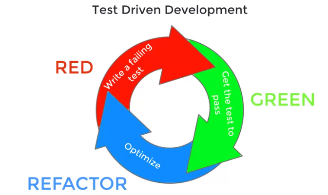</h2>

By the end, a suite of tests can be run for the whole JavaScript app, just by typing one command into the terminal:

`npm test`

This is how Jest can be used for TDD and automated testing.

### Installing Jest

Jest is based on a system called Node.JS. There are thousands of extra packages that can be installed to extend the basic functionality of Node. These are installed using the Node Package Manager (NPM).

- Firstly,  initialize the Node environment by typing from terminal window:

`npm init`

and answer the resulting questions by pressing **enter**, to keep the defaults, except for answer "test command". Here, type **jest**. This tells NPM use Jest as the testing environment.

<h2 align="left">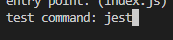</h2>

- Secondly, to installed Jest, from terminal window type:

`npm install --save-dev jest@26.6.3`

The **--save-dev** switch just tells Node to use Jest in a development environment. It adds Jest to a list called Dev Dependencies.

To run tests in the terminal for a specific JavaScript file, type (without the `.test.js` extension):

`npm test -- filename`

### Testing of app.js

app.js is the main game app, which:
- creates the game board
- generates a random moving target
- keeps score of hit targets
- speeds up the game depending on score
- terminates, resets, starts the game

#### Prerequisites Required

Before running the tests, some modification is required to **index.html** and **app.js**:

- comment out the EmailJS scripts in index.html

<h2 align="left"></h2>

- add the following line to bottom of app.js

`module.exports = { game, createGrid, startGame };`

<h2 align="left">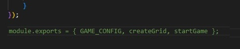</h2>

- See Bugs **4 and 5** in the **Bugs** section below for the explanation of why the prerequisites are required.

#### Tests Generated

It was decided to devise three tests:

1. Check that the score and time-left, have the correct initial values on loading game and before the start of play. The elements of ids 'score' and 'time-left' are accessed and checked that their values, via text content, are '0' and '60' respectively.
<h2 align="left"></h2>

2. Check that the board grid has been built with correct ids. The board is made up of 9 tiles in a 3x3 grid. Each tile is is given a unique id between '0' and '8'. for this test set, all elements of the class 'tile' are accessed to check that there are actually 9 tiles and that they each have the expected id. Just to double check, if the following code is added, the tests will fail.

    `expect(squares[9].id).toEqual('9');`

<h2 align="left"></h2>

3. Check that values for score and time-left will be returned back to default, when Start button (only) is clicked. Here, the score and time-left values are forced to be '88' and '8' respectively. On clicking the start button, checks are made to ensure the values return to game start defaults of '0' and '60' respectively.

<h2 align="left"></h2>

The tests above give a flavour of how automated testing can be achieved. The test results are seen below:

<h2 align="left">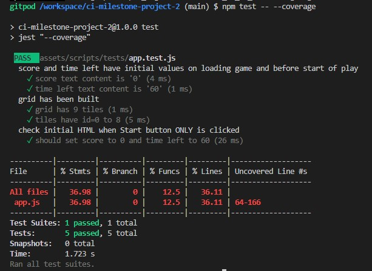</h2>

## Manual Testing

**The site was built, tested and validated on the [Chrome browser](docs/testing/manual/about-chrom.jpg) only.**

### Supported Screen Sizes and Browsers

No framework was used for building the site, only HTML5, CSS3 and JavaScript - see the [supported browsers for HTML](https://www.w3schools.com/tags/ref_html_browsersupport.asp).
    - Chrome
    - Firefox
    - Safari
    - Opera
    - Edge

* Devices supported:
    - Mac
    - Windows
    - Android
    - iOS

* See the [default breakpoints](https://www.w3schools.com/howto/howto_css_media_query_breakpoints.asp) provided by W3 Schools for responsive building. Breakpoints are a representative of a subset of common device sizes and viewport dimensions—they don’t specifically target every use case or device. Instead, the ranges provide a strong and consistent foundation to build on for nearly any device. 

    | Breakpoint               | Dimensions |
    | ------------------------ | ---------- |
    | Extra small              | <600px     |
    | Small                    | ≥600px     |
    | Medium                   | ≥768px     |
    | Large                    | ≥992px     |
    | Extra large              | ≥1200px    |

For this project it was only deemed necessary to use 2 breakpoints:

<h2 align="left">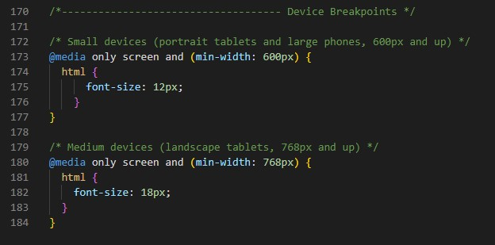</h2>

* Mobile devices - Chrome Developer Tools supplies a suite of emulated devices for simulating how sites would appear for different mobile phone models. The following were used for manually testing the project:

    <h2 align="left"></h2>

    - The game was primarily built as a mobile app and developed mainly around the smallest device on the above list, the Galaxy Fold. 

    - For all other devices, the font was scaled up as appropriate. It was not necessary to fully scale up for laptops and desktops, as this would have made the game board rather large and the game play too easy. As an extra future feature, a fully scaled up version could be built for those requiring an extra large game board.

### Testing Against User Stories

* As a visiting user, I would like to connect with the company via email.
    - The emailing feature is provided by the JavaScript library, [EmailJS](https://www.emailjs.com/). This service allows you to connect your email service, in this case Gmail, build an email template, and send it from JavaScript without any server code.

<h2 align="left"></h2>

* As a visiting user, I would like to easily understand how to play the game.
    - Instructions on how to play the game are included under the game board.

<h2 align="left"></h2>

* As a visiting user, I would like to play with increasing difficulty.
    - The randomly generated target moves quicker as the score increases, hence it becomes harder to hit the target and score points.

<h2 align="left">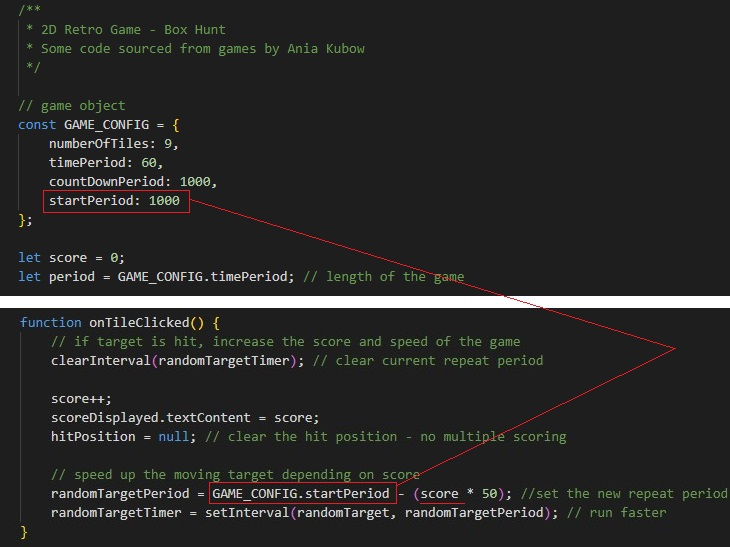</h2>

* As a visiting user, I would like to see my score. 

<h2 align="left"></h2>

### Console Errors

<h2 align="left"></h2>

1 error, 1 warning and 1 possible improvement were detected.

* The error was removed by running the site on Chrome in Incognito mode.
Stack Overflow user [Chrostip Schaejn](https://stackoverflow.com/questions/72494154/a-listener-indicated-an-asynchronous-response-by-returning-true-but-the-messag) advised that this error was cause by various Chrome extensions.

* The warning was also absent from Chrome in Incognito mode
Stack Overflow user [Takash Futada](https://stackoverflow.com/questions/69619035/error-with-permissions-policy-header-unrecognized-feature-interest-cohort) advised that "GitHub hosted pages disable FLoC, which is Google's 3rd party cookie alternative. GitHub, Microsoft, doesn't seems to like it."

* The possible improvement was still present
Google Forum user [Adrià Vilanova Martínez](https://support.google.com/chrome/thread/137261347/audit-usage-of-navigator-useragent-navigator-appversion-and-navigator-platform?hl=en) advised that "this only means that Chrome will provide less details about the user platform and Chrome version, since these are used by websites to fingerprint users."

<h2 align="left"></h2>

Now only 1 possible improvement is detected by Chrome in Incognito mode. Source is https://cdn.jsdelivr.net/npm/@emailjs/browser@3/dist/email.min.js - EmailJS

### W3C Validation

* HTML - No errors and 2 warnings were detected by [W3C](https://validator.w3.org/#validate_by_input) for pages:
    - [index.html PDF report](docs/testing/w3c/html-errors.pdf) : 5 errors, 6 warnings
    - [index.html PDF report](docs/testing/w3c/html-errors-solved.pdf) : 0 errors, 2 warnings
    - Warnings were caused by 2 headings where JavaScript would create the text content. Added aria-labels for accessibility - see WAVE section below.

    <h2 align="left"></h2>
    
    - [404.html PDF report](docs/testing/w3c/html-404.pdf) : 0 errors, 0 warnings

    <h2 align="left"></h2>

* CSS - No errors and 1 warning was detected by [Jigsaw (W3C)](https://jigsaw.w3.org/css-validator/) for:
    - [style.css PDF report](docs/testing/w3c/w3c-css.pdf)

<h2 align="left"></h2>

### Lighthouse

[Lighthouse](https://developer.chrome.com/docs/lighthouse/overview/) is an automated tool for improving the quality of web page. It checks the current webpage for performance, accessibility, best practices and SEO. 

index.html

- [Desktop PDF report](docs/testing/lighthouse/lighthouse-index-desktop-2.pdf)
<h2 align="left"></h2>

- [Mobile PDF report](docs/testing/lighthouse/lighthouse-index-mobile-2.pdf)
<h2 align="left"></h2>

404.html

The 404 page received a low score for accessibility because the page automatically directs the user back to the home page after 3 seconds. 

I was not able use a 404 page with an active link for this project repository and I believe it would require a custom domain as stated by Stack Overflow user [Daniel Powell](https://stackoverflow.com/questions/14908512/how-can-i-set-a-custom-404-page-on-github-pages).

Github have published the procedure to [create a custom 404 page](https://docs.github.com/en/pages/getting-started-with-github-pages/creating-a-custom-404-page-for-your-github-pages-site) for the Pages site username.github.io, but not for any repository. I was able to publish the 404 page with an active link for my own Pages site [janet-dev.github.io](https://janet-dev.github.io/), but not for this project repository. The index.html link was unactive on deployment but not in Developer Tools and clicking on it would cause a redirection to janet-dev.github.io. Therefore I decided to build an automatic redirection from the 404 page to this repository's home page. As the project site has only one short page, I believe this not be an accessibility issue. If the user is on the 404 page, then they clearly shouldn't be there and the one page they should be on is the home page. Automatic redirection is an issue for sites of many pages but not a small one-page site.

- [Desktop PDF report](docs/testing/lighthouse/lighthouse-404-desktop.pdf)

<h2 align="left"></h2>

- [Mobile PDF report](docs/testing/lighthouse/lighthouse-404-mobile.pdf) : Same score as for desktop

### JSHint

[JSHint](https://jshint.com/) is a community-driven tool that detects errors and potential problems in JavaScript code.

app.js

- No errors or warnings were detected.
- [JavaScript PDF report](docs/testing/jshint/jshint-app.pdf)

<h2 align="left"></h2>

sendEmail.js

- No errors, 2 warnings were detected - 1 undefined variable and 1 unused variable. Both are used in the index.html EmailJS code.

<h2 align="left"></h2>

### Web Accessibility Evaluation

[WAVE Web Accessibility Evaluation Tools](https://wave.webaim.org/) "help authors make their web content more accessible to individuals with disabilities. WAVE can identify many accessibility and Web Content Accessibility Guideline (WCAG) errors, but also facilitates human evaluation of web content. Our philosophy is to focus on issues that we know impact end users, facilitate human evaluation, and to educate about web accessibility."

Initially, the WAVE detected:
* 0 contrast errors - colour palette passed accessibility tests
* 6 errors:
    - 3 missing form labels - where placeholder text was used instead of labels
    - 2 empty headings - where headings would be generated by JavaScript for game over and email submission
    - 1 empty link - where a link was attached to an icon rather than text
+ [WAVE Report 1](docs/testing/wave/wave1-errors.jpg) : Errors
+ [WAVE Report 2](docs/testing/wave/wave2-errors.jpg) : Errors

* Errors solved by adding aria-labels to the: 
    - form inputs
    - empty headings
    - a tag in the footer for the icon
+ [WAVE Report 1](docs/testing/wave/wave1-solved.jpg) : Errors Solved
+ [WAVE Report 2](docs/testing/wave/wave2-solved.jpg) : Errors Solved

<h2 align="left"></h2>

### Further Testing

Testing and validation was carried out on the Chrome browser with Windows 10, though the site was used through others to check continuing functionality. Checked that:
- game play functioned correctly
- emails could be sent
- landing on page 404 caused a redirection to the Home page

The following browsers and devices were checked live and not through any emulators - select the coloured text to see the screenshots:

| Browser       | OS             | Device        | Game Play     | Email Received | 404 Redirect      |
| ------------- | -------------- | ------------- | ------------- | -------------- | ----------------- |
| [Chrome](docs/testing/manual/about-honor-chrome.jpg) | [Android 9.1](docs/testing/manual/about-honor.jpg) | [Honor 9 Lite](docs/testing/manual/brows-honor.jpg) | OK | [Yes](docs/testing/manual/email-honor.jpg) | OK |
| Safari 16 | [iOS 16.2](docs/testing/manual/about-ios16.jpg) | [iPhone 8](docs/testing/manual/brows-iphon.png) | OK | [Yes](docs/testing/manual/email-iphone.jpg) | OK |
| [Safari](docs/testing/manual/about-safar.png) | [macOS 15.15](docs/testing/manual/about-macos.png) | [MacBook Pro](docs/testing/manual/brows-macbk.png) | OK | [Yes](docs/testing/manual/email-macos.jpg) | OK |
| [Brave](docs/testing/manual/about-brave.jpg) | [Windows 10](docs/testing/manual/about-win10.jpg) | [Dell Desktop](docs/testing/manual/brows-brave.jpg) | OK | [Yes](docs/testing/manual/email-brave.jpg) | OK |
| [Chrome](docs/testing/manual/about-chrom.jpg) | Windows 10 | Dell Desktop | OK | [Yes](docs/testing/manual/email-win10.jpg) | OK |
| [Edge](docs/testing/manual/about-msedg.jpg) | Windows 10 | Dell Desktop | OK | [Yes](docs/testing/manual/email-msedg.jpg) | OK |
| [Opera](docs/testing/manual/about-opera.jpg) | Windows 10 | Dell Desktop | OK | [Yes](docs/testing/manual/email-opera.jpg) | OK |

### Bugs

1. Missing favicon

<h2 align="left"></h2>

- Solved by creating a custom favicon on [favicon.cc](https://www.favicon.cc/)

<h2 align="left"></h2>

2. Game non-responsive

<h2 align="left"></h2>

- Solved by following the guidelines outlayed in the article [Convert px to rem - An effective workflow](https://dev.to/swastikyadav/convert-px-to-rem-an-effective-workflow-4m4j) by Swastik Yadav on DEV Community. Basically, the root font is set in the HTML as 62.5% for 10px (100% = 16px). This sets 1rem as 10px and makes it easier to define responsive dimensions for the grid and tiles.

<h2 align="left"></h2>
<h2 align="left"></h2>

3. Grid width greater than body width for Galaxy Fold mobile

<h2 align="left">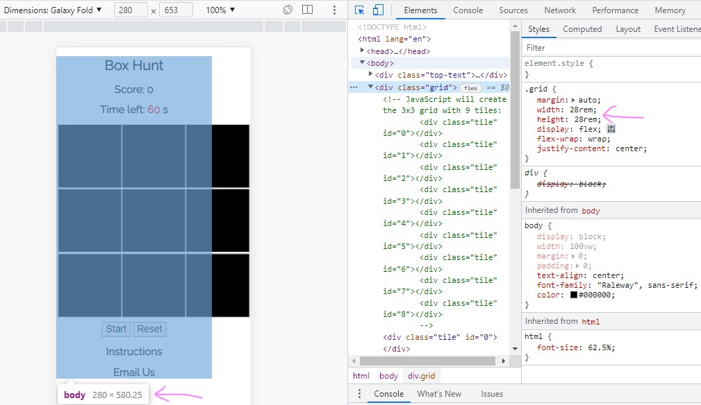</h2>

- Solved by decreasing the grid and tile widths, so that they were within the limits of the page body

<h2 align="left">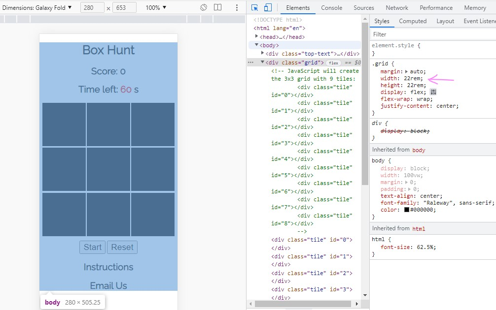</h2>

4. During Jest testing, a non-failing console-error was seen inn the terminal

<h2 align="left">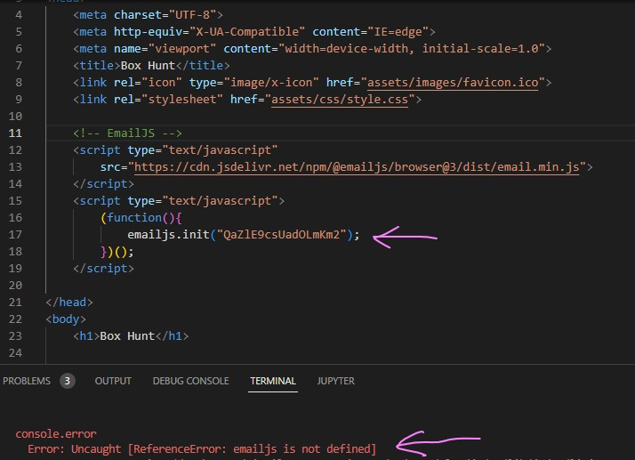</h2>

- Solved by commenting out the EmailJS scripts in index.html

<h2 align="left">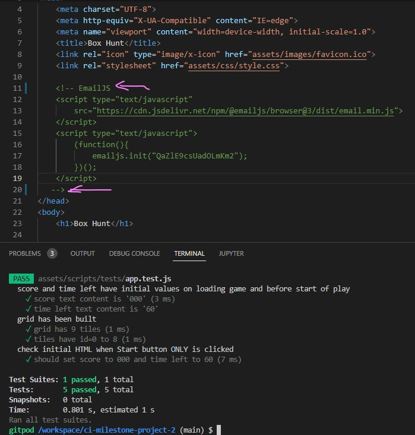</h2>

5. During Jest testing, a console error was seen in Chrome Developer tools

<h2 align="left">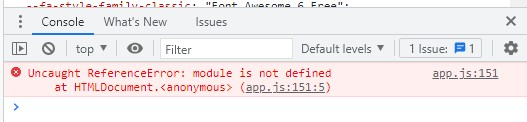</h2>

and a warning in JSHint

<h2 align="left">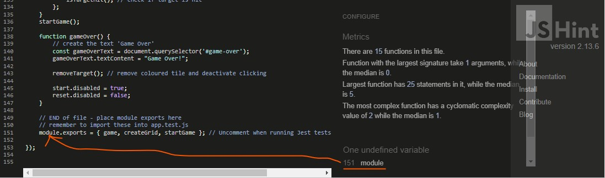</h2>

- Both solved by deleting the highlighted line below:

<h2 align="left">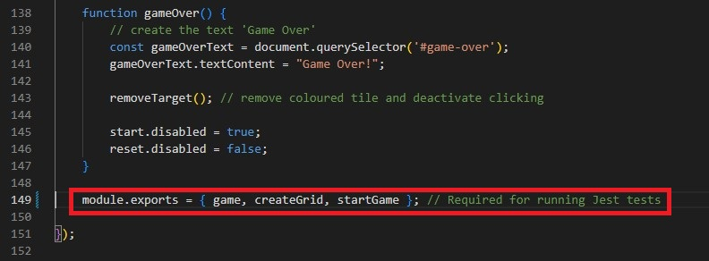</h2>

6. Link to Home page on 404 page is inactive

<h2 align="left">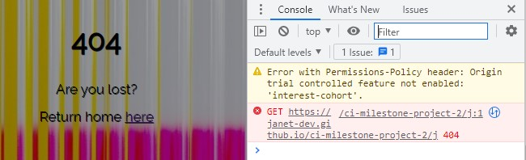</h2>

- Solved by implementing in 404.html, an automatic redirect in 3 seconds, which gives enough time to read the message
- See **404 Page** in **Lighthouse** section above for more information

<h2 align="left"></h2>
<h2 align="left"></h2>

### Known Bugs

See **Console Errors** section above. 

## Test Cases

These cases are included in order to help the next developer understand the design of the site and how to extend it. They document the look and functionality of each page.

### Home Page

Desktop/tablet/mobile screens:

<h2 align="left">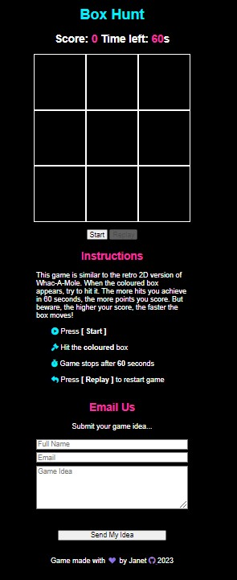</h2>

**Site View**

Colour palette used on a Black background:

<h2 align="left"></h2>

On loading the site, the following features are visible to the user.

* Game board with 
    - name of the game title **Box Hunt** in Electric Blue
    - initial values for **Score: 0** and **Time Left: 60s**. Words are in White and numbers in Persian Rose
    - 3x3 Black game board with White grid lines
    - active **Start** button (default HTML button without any extra styling)
    - inactive **Reset** button (default greyed-out HTML button without any extra styling)

<h2 align="left">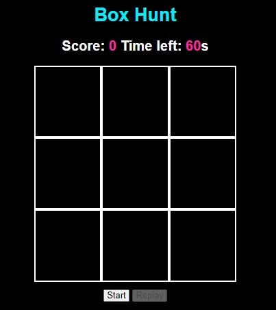</h2>

* Instructions of how to play the game and how points are accrued
    - **Instructions** heading in Persian Rose
    - list of instructions featuring an Electric Blue icon and White text

<h2 align="left"></h2>

* Contact section where the user can email in a game idea, featuring:
    - **Email Us** heading in Persian Rose
    - name input box with **Full Name** placeholder text
    - email address input box with **Email** placeholder text
    - text area with **Game Idea** placeholder text
    - **Send My Idea** button (default HTML button without any extra styling)

<h2 align="left"></h2>

* Footer section with
    - White text
    - **heart** icon in Lavender Floral
    - Lavender Floral **GitHub** icon with an active link (default HTML linking without any extra styling)

<h2 align="left"></h2>

**Site Actions**

When the user selects an active area of the screen, the following results will be seen.

* Game board - 
<h2 align="left"></h2>

Playing the game
<h2 align="left"></h2>

- 'Start' button to start play, and a greyed-out 'Reset' button. On clicking 'Start':
	- it will become inactive and greyed-out
	- the moving target will be generated
	- the score increments if target is hit and the time left counts down
	- the 'Reset' button will be active 
- On clicking 'Reset':
	- it will become inactive and greyed-out
	- the score returns to 0 and the time left to 60 seconds
	- the target disappears
	- the 'Start' button will be active

Game over
<h2 align="left"></h2>

* Email - 
<h2 align="left"></h2>

Entering details
<h2 align="left">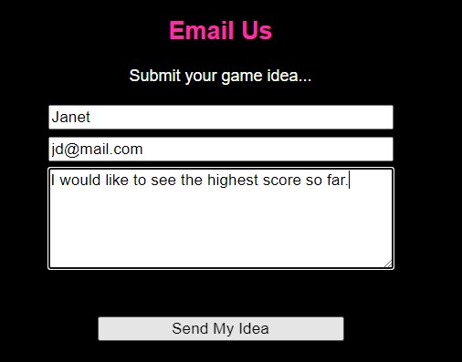</h2>

Email sent
<h2 align="left">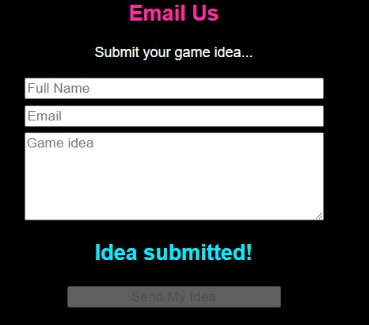</h2>

Email received
<h2 align="left">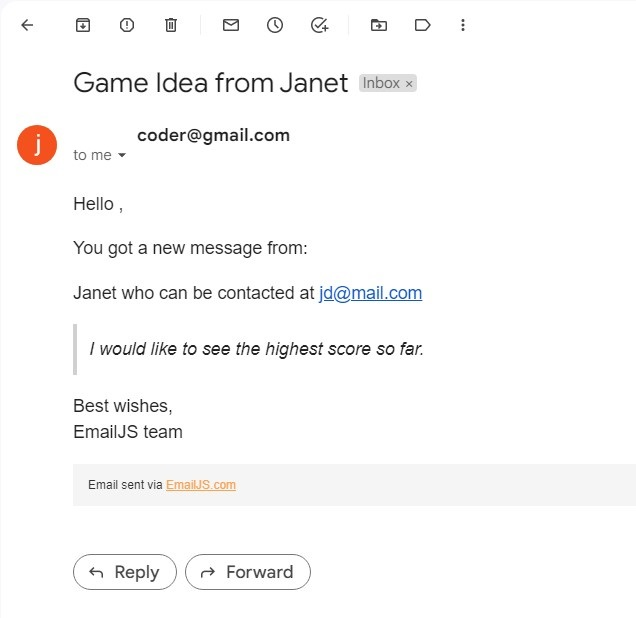</h2>

* Footer - 
<h2 align="left"></h2>
* Social media link for GitHub account accessed via the appropriate icon.

#### 404 Page

## Credits

A huge thank you to the following people and organisations, because without you, the project would not have been produced in it's present form.

### From the Course

Jest Testing Walkthrough Tutorials from [Code Institute](https://github.com/Code-Institute-Solutions/Jest_Testing_Part2/blob/main/09_Final_Codealong_2/scripts/tests/game.test.js)

Markdown Cheatsheet from [Adam Pritchard](https://github.com/adam-p/markdown-here/wiki/Markdown-Cheatsheet#html)

### Code
Although the code is the work of the author, some of the code has been sourced from or inspired by others.

[Jest Docs](https://jestjs.io/docs/getting-started)

[How to ignore lines for code coverage in Jest](https://stackoverflow.com/questions/38740165/how-to-ignore-lines-for-code-coverage-in-jest) on Stack Overflow

[Jest](https://www.w3resource.com/jest/introduction.php) from w3resource

[ARE YOU STRUGGLING WITH NULL VALUES IN JEST?](https://code-institute-room.slack.com/archives/C7HD37Q1F/p1650618994260909) on Code Institute Slack Channel project-milestone-2 by Benjamin Kavanagh

[Use Jest write unit testing for DOM manipulation](https://dev.to/ms314006/use-jest-write-unit-testing-for-dom-manipulation-3n6c) by Clark on Dev.to

[aria-label](https://developer.mozilla.org/en-US/docs/Web/Accessibility/ARIA/Attributes/aria-label)

[Disallow aria-label misuse](https://html-validate.org/rules/aria-label-misuse.html)